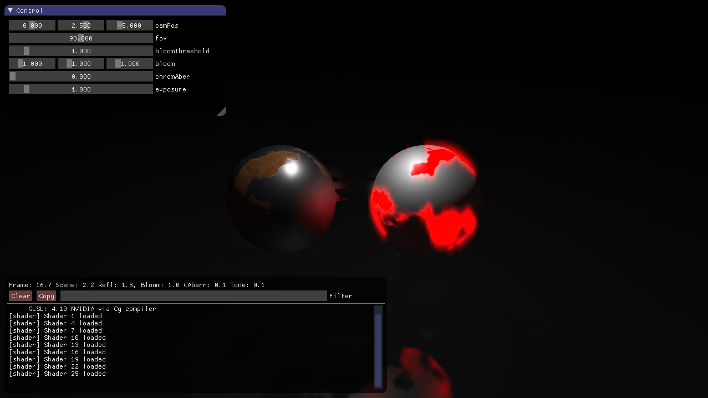

# pbr-playground

The original [skunkwork](https://www.github.com/sndels/skunkwork) repo that turned
into a demo base with a hard coded post-processing pipeline. Implements PBR-shading along the
lines of UE4 and also has simplex noise + fbm. MERCURY's [HG_SDF](http://mercury.sexy/hg_sdf)
is included for CSG. Decent bloom and hdr/gamma -correction are present as post-stages.
Mouse click positions are used for camera control. There is some artefacting due to naive
reflections (no edge detection) and edge flicker induced bloom flashing.

## Dependencies
Building only requires OpenGL externally. [GLFW3](http://www.glfw.org),
[GLM](http://glm.g-truc.net/0.9.8/index.html), [dear imgui](https://github.com/ocornut/imgui)
 and [pre-generated gl3w](https://github.com/sndels/libgl3w)
are provided as submodules.

## Building
The CMake-build should work™ on OSX, Linux and Windows (Visual Studio 2017).
